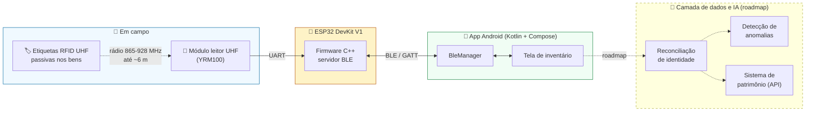
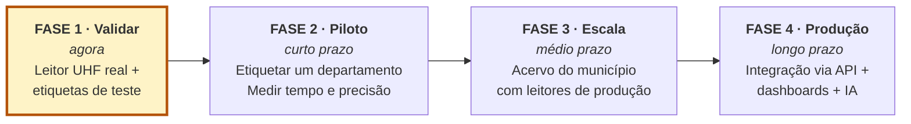

# 🏷️ Patrimônio Inteligente

**Modernização do inventário patrimonial público com RFID UHF — do papel ao tempo real.**

[](LICENSE)
[](https://creativecommons.org/licenses/by/4.0/deed.pt-br)
[](#-estado-real-do-projeto)
[](#-procuram-se-parceiros)

> Inventário patrimonial na administração pública ainda se faz com prancheta e caneta — placa por placa, sala por sala, ao longo de meses. Quando termina, os dados já nasceram velhos.
>
> Este repositório é uma tentativa de fazer o próximo inventário levar dias. E é público porque **essa dor quase certamente também é a do seu município**.

---

## 📌 Sumário

- [Por que isso importa (e por que não é só nosso)](#-por-que-isso-importa-e-por-que-não-é-só-nosso)
- [Como funciona](#️-como-funciona)
- [Estado real do projeto](#-estado-real-do-projeto)
- [Onde entra a Inteligência Artificial](#-onde-entra-a-inteligência-artificial)
- [Reproduza no seu município](#-reproduza-no-seu-município)
- [Protocolo BLE](#-protocolo-ble)
- [Roadmap](#️-roadmap)
- [Procuram-se parceiros](#-procuram-se-parceiros)
- [Contexto institucional](#️-contexto-institucional)
- [Licença](#-licença)

---

## 🎯 Por que isso importa (e por que não é só nosso)

O patrimônio público é um dos maiores ativos da administração — e o mais difícil de controlar. O diagnóstico se repete, com pouca variação, de órgão em órgão:

| A dor | O que acontece na prática |
|---|---|
| **Inventário manual e lento** | Servidor com prancheta anotando placa por placa, sala por sala. |
| **Dados que já nascem velhos** | Quando o inventário termina, meses depois, a realidade já mudou. |
| **Falta de rastreabilidade** | Não se sabe, em tempo real, onde cada bem está — nem se ainda existe. |

### O custo da inação

Não é burocracia atrasada. É risco jurídico e dinheiro escorrendo por três frentes:

- **Conformidade** — ressalvas do Tribunal de Contas nas contas anuais; descumprimento do registro analítico dos bens exigido pela **Lei nº 4.320/1964** (arts. 94 a 96), pelo **MCASP** e pelas **NBC TSP**; responsabilização pessoal de gestores.
- **Patrimonial** — bens "fantasma" que constam no sistema mas não existem mais; balanço e depreciação calculados sobre dados incorretos; perdas silenciosas descobertas anos depois.
- **Operacional** — horas-homem qualificadas digitando placa por placa; retrabalho para localizar e reconciliar itens; compras duplicadas e remanejamentos no escuro.

> *"Não se controla o que não se consegue medir — e hoje medimos o patrimônio com prancheta e caneta."*

### A escala do problema

Para dar ordem de grandeza: o acervo patrimonial de um município de porte médio-grande passa facilmente de **180 mil bens**, espalhados por centenas de unidades — escolas, unidades de saúde, almoxarifados, prédios administrativos. Conferir isso manualmente mobiliza **centenas de servidores ao longo de vários meses**.

Na prática de campo, uma sala com cerca de 30 postos de trabalho consome em torno de **7,5 servidor-horas** de conferência (três pessoas, duas a três horas). Multiplique por um acervo de seis dígitos e fica claro por que o inventário vira um evento de década, e não uma rotina.

E o custo não é só o tempo: quanto mais raro o inventário, mais o cadastro se descola da realidade física entre um ciclo e outro. Bens mudam de sala, mudam de unidade responsável, são desativados, perdem a plaqueta — e nada disso é registrado até a próxima conferência geral. **O cadastro não erra de uma vez; ele apodrece devagar.**

Se você trabalha com patrimônio em qualquer prefeitura, autarquia ou órgão público brasileiro, provavelmente acabou de ler a descrição do seu próprio setor. **É exatamente por isso que este código está aberto.** Não faz sentido 5.570 municípios resolverem o mesmo problema isoladamente, cada um pagando o mesmo aprendizado.

---

## ⚙️ Como funciona

Etiquetas **RFID UHF passivas** (sem bateria, baratas, duráveis) são fixadas nos bens e vinculadas à placa patrimonial. Um leitor móvel varre o ambiente por rádio — **dezenas de itens por segundo, à distância, sem contato visual** — e envia as leituras via Bluetooth para um aplicativo Android, que reconcilia com o cadastro e aponta o que falta, o que sobra e o que mudou de lugar.



### O mesmo inventário, dois mundos

| Hoje (manual) | Com RFID UHF |
|---|---|
| Placa por placa, no olho | Leitura em massa por rádio |
| Meses de execução | Horas / dias |
| Fotografia que já nasce velha | Conferência contínua |
| Erro de digitação | Captura automática do código |

---

## 🔍 Estado real do projeto

**Esta seção existe porque vitrine sem honestidade não serve para ninguém.** Se você está avaliando adotar este projeto, precisa saber exatamente onde ele está — inclusive o que ainda não existe.

| Componente | Estado | Observação |
|---|:---:|---|
| Firmware ESP32 (servidor BLE) | ✅ **Funciona** | Testado em hardware real, ESP32 DevKit V1 |
| App Android nativo (Kotlin + Compose) | ✅ **Funciona** | Compila e roda em aparelho físico, Android 12+ |
| Comunicação bidirecional BLE | ✅ **Funciona** | Validada ponta a ponta, com fragmentação de mensagens longas |
| Controle de GPIO / feedback físico | ✅ **Funciona** | LED onboard como indicador de varredura ativa |
| Fluxo de leitura patrimonial | 🟡 **Simulado** | O ESP32 devolve um registro patrimonial fictício após 800 ms |
| Leitura de tag RFID UHF real | ❌ **Não existe** | **Bloqueado: falta adquirir o módulo leitor** |
| Persistência local (histórico) | ❌ **Não existe** | Planejado com Room |
| Integração com sistema de patrimônio | ❌ **Não existe** | Depende de API do sistema municipal |
| Camada de IA (reconciliação, anomalias) | ❌ **Não existe** | Especificada em [Onde entra a IA](#-onde-entra-a-inteligência-artificial) |

### O que exatamente está simulado

Como a compra do módulo leitor ainda não foi liberada, implementamos o **fluxo completo com o hardware que já tínhamos**. Ao acionar "Escanear", o ESP32 acende o LED (simulando a antena UHF ativa), aguarda 800 ms (simulando o tempo de leitura) e transmite via BLE um registro patrimonial fictício, que o app remonta e exibe na tela.

Isso significa que **toda a espinha dorsal — captura, transporte, fragmentação, remontagem e exibição — está construída e validada**. O que falta é substituir a string fictícia pelo EPC real vindo da antena. É uma troca de origem de dado, não uma reescrita.

> ### 🚧 O gargalo, dito com todas as letras
>
> O projeto está travado por uma compra de aproximadamente **R$ 1.200**. Não é um problema técnico — é um trâmite administrativo. Enquanto isso, o firmware que conversaria com o leitor está escrito e esperando.
>
> **Se o seu órgão já tem um leitor UHF na gaveta, você pode nos ajudar a destravar isto em uma tarde.** Veja [Procuram-se parceiros](#-procuram-se-parceiros).

---

## 🧠 Onde entra a Inteligência Artificial

Sejamos precisos: **hoje este projeto não tem IA nenhuma.** É captura de dado — IoT e automação.

Mas é exatamente por isso que ele importa para uma agenda de IA no setor público. Não existe IA sobre patrimônio hoje porque **não existe dado de patrimônio** — existe uma planilha levantada de tempos em tempos. O RFID é o sensor que transforma o inventário de *evento raro* em *fluxo contínuo*. Sem esse substrato, as quatro aplicações abaixo são impossíveis; com ele, são as próximas na fila.

Estão especificadas aqui como convite explícito a colaboradores e como declaração de roadmap — **nenhuma delas está implementada.**

<table>
<tr><th width="20%">Aplicação</th><th>Problema real</th><th>Entrada → Saída</th><th>Métrica</th></tr>
<tr>
<td><b>Reconciliação de identidade e lotação</b></td>
<td>Dois problemas que aparecem juntos em qualquer inventário real. O mesmo bem aparece no cadastro como <code>NOTEBOOK POSITIVO MOTION</code> e como <code>Microcomputador portátil Positivo</code>. E uma fatia expressiva dos bens efetivamente encontrados está <b>fisicamente em um lugar e contabilmente em outro</b> — lotados em unidade orçamentária errada, ou em unidades já desativadas que continuam com patrimônio ativo em seu nome. Conciliar isso é hoje leitura humana linha a linha.</td>
<td>EPC lido + local da leitura + descrição do cadastro → vínculo com o registro correto e proposta de relotação, com grau de confiança</td>
<td>% de casamento automático correto; % de relotações aceitas; redução da fila de conferência manual</td>
</tr>
<tr>
<td><b>OCR de placa patrimonial</b></td>
<td>Durante a transição, a esmagadora maioria do acervo <b>não tem etiqueta RFID</b>. Etiquetar um acervo inteiro é o próprio gargalo. Pior: todo inventário encontra um volume relevante de bens <b>fisicamente presentes e sem plaqueta nenhuma</b> — existem, mas não são identificáveis. Ler a placa metálica pela câmera cobre o primeiro caso; o segundo vira fila de reemplacamento, e a triagem também é automatizável.</td>
<td>Foto da placa → número patrimonial estruturado</td>
<td>Acurácia sobre placas desgastadas, oxidadas e mal iluminadas</td>
</tr>
<tr>
<td><b>Enquadramento contábil assistido</b></td>
<td>Classificar bem novo em conta contábil, vida útil e taxa de depreciação conforme MCASP exige conhecimento especializado e é fonte recorrente de erro de balanço.</td>
<td>Descrição do bem → conta contábil sugerida + vida útil + taxa, com justificativa</td>
<td>Concordância com a classificação de servidor especialista</td>
</tr>
<tr>
<td><b>Detecção de anomalias</b></td>
<td>Bens que "andam" entre salas sem movimentação formal; padrões que antecedem sumiço; divergências sistemáticas por unidade.</td>
<td>Série histórica de leituras por local → alertas priorizados</td>
<td>Precisão dos alertas; tempo até detecção de divergência</td>
</tr>
</table>

**Nota de soberania e infraestrutura:** a reconciliação e a detecção de anomalias são tratáveis com modelos clássicos rodando em infraestrutura própria, sem dependência de serviço externo — decisão relevante porque dados patrimoniais são dados da administração. Nenhuma das aplicações acima exige envio de dado a terceiros, e essa restrição é um requisito de projeto, não um detalhe.

---

## 🔧 Reproduza no seu município

### Lista de materiais

| Item | Função | Custo estimado |
|---|---|---|
| ESP32 DevKit V1 | Microcontrolador com BLE nativo | ~R$ 50 |
| Módulo leitor RFID UHF **YRM100** | Antena e rádio UHF | ~R$ 600 |
| Lote de etiquetas UHF para teste | Tags passivas EPC Gen2 | ~R$ 200 |
| Fonte externa 5V + acessórios | Alimentação do módulo | ~R$ 400 |
| Smartphone Android 12+ | Executa o app | Já disponível na maioria dos setores |

> **Sobre o custo do módulo:** o preço varia bastante conforme a origem — importação direta sai consideravelmente mais barata que aquisição por fornecedor nacional dentro de processo formal de compra, onde incidem impostos e intermediação. Adotamos **~R$ 600** como referência de compra institucional. **Orce conforme a sua realidade de aquisição** — a bancada completa de validação fica em torno de **R$ 1.200**.

**Especificações do YRM100:** protocolo EPCglobal UHF Class 1 Gen 2 / ISO 18000-6C · frequência 865–868 MHz (EU) ou 902–928 MHz (US) · alcance 0–6 m conforme antena, tag e ambiente · alimentação 3,7–5 V · potência RF ajustável 15–26 dBm · comunicação UART.

> ⚠️ **Alimentação:** o YRM100 consome picos de 200–260 mA. **Não alimente pelo pino 3.3V/5V do ESP32.** Use fonte externa de 5 V com GND compartilhado, sob pena de resets e leituras erráticas.

### Firmware (ESP32)

1. Instale a **Arduino IDE** e o suporte a placas ESP32.
2. Abra `firmware/firmware.ino` — os arquivos `.h`/`.cpp` do diretório são carregados automaticamente.
3. Selecione a placa **ESP32 Dev Module** e a porta serial correspondente.
4. Compile e grave. Abra o Serial Monitor em **115200 baud** para acompanhar os logs.

```
[BOOT] ESP32 iniciado
[BOOT] Inicializando BLE...
[BOOT] BLE iniciado. Aguardando conexões...
[BLE] Dispositivo conectado!
[RX] Recebido: LED_ON
[SCANNER] Escaneando...
[TX] Enviando mensagem longa (140 bytes)...
```

### Aplicativo Android

Requer JDK do Android Studio. No Windows (PowerShell):

```powershell
$env:JAVA_HOME="C:\Program Files\Android\Android Studio\jbr"
.\gradlew.bat installDebug
```

No Linux/macOS:

```bash
./gradlew installDebug
```

O app solicitará permissões de Bluetooth na primeira execução (obrigatório no Android 12+). Em seguida: **Ligar Scanner** → **Escanear**.

### Ambiente de referência

| Componente | Versão |
|---|---|
| ESP32 | DevKit V1 (ESP32-D0WD-V3 rev3.1) |
| Android Gradle Plugin | 9.2.1 |
| Gradle | 9.4.1 |
| Kotlin | 2.2.10 (embutido pelo AGP) |
| Compose BOM | 2026.02.01 |
| Android mínimo | 12 (API 31) |

> 💡 **Armadilha do AGP 9.x:** o AGP 9 embute o plugin `org.jetbrains.kotlin.android` internamente. Declará-lo novamente no `build.gradle.kts` quebra o build com `Cannot add extension with name 'kotlin'`. Apenas o `kotlin-compose` precisa ser declarado à parte. Perdemos horas nisso — fica registrado para você não perder.

---

## 📡 Protocolo BLE

O firmware expõe um **Nordic UART Service (NUS)**, padrão de fato para comunicação serial sobre BLE. Isso significa que **você pode testar o hardware sem o nosso app**, usando qualquer terminal BLE genérico (nRF Connect, Serial Bluetooth Terminal), e que qualquer cliente — inclusive iOS ou desktop — pode falar com o leitor.

**Nome anunciado:** `RFID-POC-ESP32`

| Papel | UUID | Propriedades |
|---|---|---|
| Serviço | `6E400001-B5A3-F393-E0A9-E50E24DCCA9E` | — |
| **RX** (app → ESP32) | `6E400002-B5A3-F393-E0A9-E50E24DCCA9E` | `WRITE`, `WRITE_NR` |
| **TX** (ESP32 → app) | `6E400003-B5A3-F393-E0A9-E50E24DCCA9E` | `NOTIFY` (descritor `0x2902`) |

### Comandos

| Comando (escrito em RX) | Ação no ESP32 | Resposta em TX |
|---|---|---|
| `LED_ON` | Aciona a varredura: acende o LED (GPIO 2), aguarda 800 ms | Registro patrimonial fragmentado, terminado por `__END__` |
| `LED_OFF` | Encerra a varredura, apaga o LED | `SCANNER_OFF` |

### Fragmentação de mensagens longas

O BLE transporta cerca de **20 bytes úteis por notificação** na configuração padrão, e um registro patrimonial tem ~140 caracteres. O firmware quebra a mensagem em blocos de 20 bytes com intervalo de 50 ms entre eles e encerra com o marcador `__END__`; o app acumula os fragmentos e só renderiza ao receber o marcador.

```
TX → "Placa Patrimonial 14"
TX → "7258 - Notebook Posi"
TX → "tivo encontrado e re"
...
TX → "__END__"          ← app remonta e exibe
```

> 🔨 **Débito técnico assumido:** os comandos ainda se chamam `LED_ON`/`LED_OFF`, herança da fase de aprendizado do BLE. Devem ser renomeados para `SCAN_START`/`SCAN_STOP`, e a resposta deve virar um payload estruturado (EPC + metadados) em vez de texto corrido. Está mapeado — veja as issues abertas.

---

## 🗺️ Roadmap



**📍 Estamos aqui:** entre validar e pilotar — com a base tecnológica construída e aguardando o componente final.

<details>
<summary><b>Detalhamento das tarefas por horizonte</b></summary>

**Curto prazo — enquanto o hardware não chega**
- [ ] Enriquecer a simulação com múltiplos ativos e lista de inventário
- [ ] Persistência local com Room (histórico de leituras)
- [ ] Renomear comandos BLE (`SCAN_START`/`SCAN_STOP`) e estruturar o payload
- [ ] Refatorar a UI de painel de botões para tela de auditoria e inventário

**Médio prazo — após aquisição do YRM100**
- [ ] Conectar o YRM100 ao ESP32 via UART com fonte externa 5 V
- [ ] Implementar os comandos HEX de inventário do módulo no firmware
- [ ] Substituir a mensagem simulada pelo EPC real lido da tag
- [ ] Caracterizar leitura a diferentes distâncias, ângulos e materiais (metal e líquido degradam UHF)

**Longo prazo — produção**
- [ ] Avaliar módulo industrial (JRD4035 ou superior) para anti-colisão em massa
- [ ] Antena UHF externa para alcance superior a 6 m
- [ ] Integração com o sistema de patrimônio via API REST
- [ ] Camada de reconciliação e detecção de anomalias
- [ ] Painéis gerenciais e relatórios de conformidade

</details>

---

## 🤝 Procuram-se parceiros

Este projeto vale muito mais integrado do que replicado. Se qualquer um dos itens abaixo descreve você, **[abra uma issue](../../issues) ou entre em contato**:

| Se você... | O que podemos fazer juntos |
|---|---|
| 🔬 **Já tem um leitor UHF** em outro órgão | Rodar nosso firmware no seu hardware e destravar a validação que está parada por uma compra |
| 🏛️ **Enfrenta a mesma dor** em outro município | Adotar, adaptar e nos contar o que quebrou — o aprendizado de campo é o ativo mais escasso aqui |
| 💻 **Desenvolve** (Kotlin, C++, dados, IA) | Pegar qualquer item do roadmap; a camada de IA está especificada e livre |
| 📊 **Trabalha com patrimônio ou contabilidade pública** | Revisar o modelo de dados, a aderência ao MCASP e o fluxo de reconciliação |
| 🏫 **É de universidade ou instituto de pesquisa** | Caracterização de RFID em ambiente real, OCR de placas, reconciliação de entidades |
| ⚖️ **Já publicou software público** | Nos orientar sobre o trâmite de autorização institucional de publicação |

Veja [CONTRIBUTING.md](CONTRIBUTING.md) para o processo. **Relatos de uso e de fracasso são tão bem-vindos quanto código** — saber que o alcance despencou num almoxarifado metálico vale mais para o próximo município do que um pull request.

---

## 🏛️ Contexto institucional

Desenvolvido no **Departamento de Planejamento e Gestão de Recursos (DPGR) da Prefeitura de São José dos Campos - SP**, a partir de uma necessidade concreta de modernização do controle patrimonial.

O projeto nasceu de iniciativa própria do departamento, com recurso mínimo, e é publicado no espírito do **BBSIA — Banco Brasileiro de Soluções de IA para a Gestão Pública** (ENAP/LIIA): compartilhar soluções organizadas pelo problema que resolvem, para que órgãos públicos parem de reconstruir isoladamente o que já existe.

📄 O histórico técnico detalhado do desenvolvimento está em [`docs/`](docs/).

---

## 📜 Licença

**Código:** [Apache License 2.0](LICENSE) — uso, modificação e redistribuição livres, inclusive para fins comerciais, com concessão expressa de patente e exigência de atribuição.

**Documentação** (`docs/`): [CC BY 4.0](https://creativecommons.org/licenses/by/4.0/deed.pt-br).

Escolhemos uma licença permissiva deliberadamente: o objetivo é **remover atrito de adoção**. Um jurídico municipal aprova Apache 2.0 sem discussão, e um fornecedor consegue integrar este código ao sistema de patrimônio já contratado pela sua prefeitura sem conflito de licença. Copyleft protegeria melhor contra apropriação, mas ao custo de reduzir exatamente o alcance que buscamos.

> ⚖️ **Titularidade:** nos termos do art. 4º da Lei nº 9.609/1998, os direitos sobre software desenvolvido por servidor no exercício da função pertencem, em regra, ao ente empregador. A formalização da autorização institucional de publicação está em curso — veja o arquivo [NOTICE](NOTICE) para os detalhes.

---

<div align="center">

**Se o seu município também mede patrimônio com prancheta e caneta, este repositório é seu.**

*Modernizar o patrimônio começa com R$ 1.200 e uma decisão.*

</div>
