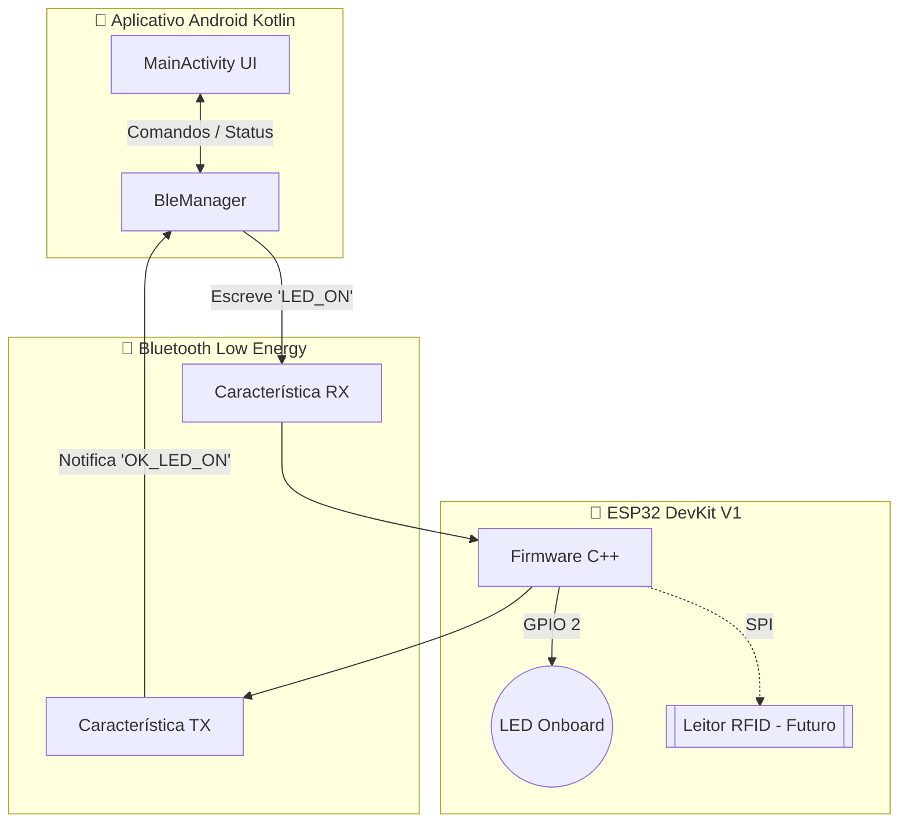

# 🏷️ RFID POC (Proof of Concept)

Bem-vindo ao projeto **RFID POC**, uma prova de conceito focada na integração de hardware embarcado (ESP32) com um aplicativo móvel nativo (Android/Kotlin) utilizando comunicação **Bluetooth Low Energy (BLE)**.

Atualmente, o projeto concluiu sua etapa fundacional (Fases 1 e 2), estabelecendo um canal de comunicação bidirecional robusto entre o smartphone e o microcontrolador, permitindo o controle remoto de hardware (LED) com confirmação em tempo real.

---

## 🏗️ Arquitetura do Projeto

O ecossistema é dividido em duas frentes principais: **Firmware (ESP32)** e **Software (Android App)**.

### 1. Firmware (ESP32 / Arduino IDE)
Desenvolvido em C++, o ESP32 atua como um **Servidor BLE** (`RFID-POC-ESP32`).
- **Service UUID**: Define o "serviço de automação/RFID" do dispositivo.
- **RX Characteristic**: Ponto de entrada. Ouve ativamente os comandos disparados pelo celular.
- **TX Characteristic**: Ponto de saída. Emite notificações (Subscribe) para o celular informando o resultado de uma operação.
- **Led Controller**: Módulo isolado de controle físico de portas (GPIO).

### 2. Software (Android App / Kotlin)
Aplicativo nativo moderno preparado para as exigências de privacidade e permissões do Android 12+.
- **`BleManager`**: O motor do aplicativo. Faz a varredura (*Scanning*), conecta-se ao servidor GATT do ESP32 e gerencia os descritores de notificação.
- **`MainActivity`**: Interface gráfica amigável com logs em tempo real na tela, permitindo auditoria visual dos pacotes trocados (`[TX]` e `[RX]`).

---

## ✅ O que já temos rodando (Estado Atual)

Neste exato momento, o projeto permite:
1. **Descoberta**: O celular Android detecta a presença do ESP32 via rádio BLE.
2. **Handshake**: A conexão GATT é firmada de forma segura.
3. **Controle Bidirecional**: 
   - Ao apertar `LED ON` no app, a string é convertida em *Bytes*, viaja pelo ar, o ESP32 intercepta na porta RX, liga o LED azul físico e manda a string `OK_LED_ON` na porta TX.
   - O aplicativo ouve a notificação e atualiza a interface instantaneamente.

---

## 🚀 Próximos Passos (Evolução para RFID)

Com a espinha dorsal de comunicação BLE validada, a base está pronta para a verdadeira natureza da "Proof of Concept": **A integração do leitor RFID**.

### Próximas Implementações Esperadas:
- [ ] **Integração de Hardware (ESP32 + Leitor)**: Conectar um leitor RFID (ex: MFRC522) ao ESP32 via barramento SPI.
- [ ] **Firmware RFID**: Implementar a lógica no ESP32 para detectar a aproximação de um cartão/tag.
- [ ] **Notificação Proativa via BLE**: Quando uma tag for lida, o ESP32 enviará automaticamente o UID do cartão pela característica TX (`TAG_DETECTED: A1B2C3D4`) sem precisar ser perguntado.
- [ ] **App Android (Leitura e Processamento)**: O aplicativo Android receberá o UID, fará o parsing da mensagem e exibirá os dados da Tag na tela (podendo, no futuro, consultar uma base de dados externa ou API para liberar uma catraca ou porta).
- [ ] **Refatoração UI/UX**: Melhorar a interface do aplicativo para focar em "Auditoria de Acessos" em vez de um simples painel de botões.
